# Vibe Coding 知识图谱

> 术语之间的关联网络（Mermaid 格式，可直接渲染）。

---

## 完整网络图

```mermaid
graph TB
    %% 范式层
    VC["Vibe Coding<br/>(Karpathy 2025)"]:::core
    AP["Agentic Programming<br/>(Fowler)"]:::core
    AIASD["AI-Assisted Software Dev"]:::core
    PDD["Prompt-Driven Development"]:::core
    S4O["Software for One<br/>(Kevin Roose)"]:::core
    NC["No-Code / Low-Code"]:::core

    %% 方法论层
    SDD["Specification-Driven Dev<br/>(SDD)"]:::method
    SPEC["Spec.md as Contract"]:::method
    CE["Context Engineering"]:::method
    PVB["Plan-Verify-Build Loop"]:::method
    IR["Iterative Refinement"]:::method
    AC["Acceptance Criteria"]:::method
    TDD["TDD with AI"]:::method

    %% 技术层
    LLM["LLM"]:::tech
    FM["Frontier Model"]:::tech
    CM["Code Model"]:::tech
    CW["Context Window"]:::tech
    HAL["Hallucination"]:::tech
    AL["Agent Loop"]:::tech
    SA["Subagent"]:::tech
    TU["Tool Use / Function Calling"]:::tech
    MCP["MCP<br/>Model Context Protocol"]:::tech
    PK["Pass@k Metric"]:::tech

    %% 工具层
    CUR["Cursor"]:::tool
    WIND["Windsurf"]:::tool
    CC["Claude Code"]:::tool
    COP["GitHub Copilot"]:::tool
    REPL["Replit Agent"]:::tool
    LOV["Lovable"]:::tool
    AID["Aider"]:::tool
    CRB["CodeRabbit"]:::tool
    VER["Veracode"]:::tool

    %% 质量层
    GR["Guardrails"]:::quality
    MVP["Mechanical Verification Pipeline"]:::quality
    YOLO["YOLO Mode"]:::quality
    RVC["Responsible Vibe Coding"]:::quality
    SNT["Safety Net Testing"]:::quality
    CR["Code Review / Diff Review"]:::quality
    CAR["Compiler as Referee"]:::quality
    TSR["Test Suite as Referee"]:::quality

    %% 风险层
    TD["Technical Debt"]:::risk
    CCH["Code Churn"]:::risk
    CDUP["Code Duplication"]:::risk
    VS["Vibe Slop"]:::risk
    VCH["Vibe Coding Hangover"]:::risk
    DH["Development Hell"]:::risk
    LT["Lethal Trifecta"]:::risk
    VV["Vibe Valuation"]:::risk
    HOM["Homogenization of SW"]:::risk
    ES["Eternal September"]:::risk

    %% Prompt Engineering
    FSP["Few-Shot Prompting"]:::prompt
    COT["Chain-of-Thought"]:::prompt
    SRE["Self-Review Prompting"]:::prompt
    NEG["Negative Prompting"]:::prompt
    DEC["Task Decomposition"]:::prompt
    PI["Prompt Injection"]:::prompt

    %% 关系
    VC --> AIASD
    AP --> AIASD
    PDD --> AIASD
    S4O --> VC
    VC -. "边界" .- AP
    VC -->|"迭代"| IR

    SDD --> SPEC
    SPEC --> PDD
    PDD --> IR
    IR --> AC
    CE --> CW
    CE --> TU
    PVB --> SA
    PVB --> TDD
    PVB --> CAR

    LLM --> FM
    LLM --> CM
    LLM --> CW
    LLM --> HAL
    LLM --> AL
    AL --> SA
    AL --> TU
    TU --> MCP
    PK --> CM

    VC --> CUR
    VC --> WIND
    VC --> CC
    AP --> CC
    AP --> COP
    VC --> LOV
    VC --> REPL
    CRB --> CR
    VER --> GR

    GR --> MVP
    GR --> SNT
    YOLO -. "反义" .- RVC
    RVC --> MVP
    MVP --> CAR
    MVP --> TSR
    CAR --> CR
    TSR --> CR

    VC -. "风险" .- TD
    VC -. "风险" .- VS
    VS --> TD
    TD --> CCH
    TD --> CDUP
    VC -. "可触发" .- LT

    IR --> DEC
    IR --> COT
    SRE --> CR
    PI -. "威胁" .- CE

    NC -. "邻近" .- VC

    classDef core fill:#fef3c7,stroke:#b45309,stroke-width:2px,color:#78350f
    classDef method fill:#dbeafe,stroke:#1d4ed8,stroke-width:2px,color:#1e3a8a
    classDef tech fill:#dcfce7,stroke:#15803d,stroke-width:2px,color:#14532d
    classDef tool fill:#f3e8ff,stroke:#7c3aed,stroke-width:2px,color:#581c87
    classDef quality fill:#fed7aa,stroke:#c2410c,stroke-width:2px,color:#7c2d12
    classDef risk fill:#fecaca,stroke:#dc2626,stroke-width:2px,color:#7f1d1d
    classDef prompt fill:#cffafe,stroke:#0e7490,stroke-width:2px,color:#164e63
```



---

## 网络缺口识别

### 已连接 ✅
- Vibe Coding ↔ Agentic Programming（边界关系）
- Vibe Coding → Cursor / Claude Code / Lovable
- LLM → Context Window / Hallucination / Agent Loop
- Agent Loop → Subagent / Tool Use
- Tool Use → MCP
- Guardrails → Mechanical Verification Pipeline

### 待补充缺口 ⚠️
1. **场景分类** 未在图中（已写在 L7 笔记，需映射到工具/方法组合）
2. **Specification-Driven Development → Spec Kit → Claude Code 的工作流** 需具体化
3. **Vibe Coding Hangover → Technical Debt → Refactoring Metrics** 的因果链需补
4. **YOLO Mode 与 Lethal Trifecta 的关系** 需补充
5. **Few-Shot Prompting → Cursor / Claude Code 的具体集成方式** 需说明

### 已识别的孤立术语
- **Vibe Valuation**（投资领域类比）—— 与 vibe coding 平行
- **Eternal September**（开源社区影响）—— 与 Vibe Slop 并列
- **No-Code Development Platform** —— 与 vibe coding 平行的相邻范式

---

## 知识库目录结构

```
knowledge/
├── 00-knowledge-graph.md      ← 本图谱
├── 01-glossary-A-Z.md          ← A-Z 词条总表（按字母查）
├── 02-taxonomy.md              ← 分类树
├── 03-relationships.md         ← 关系矩阵
├── 04-scenarios.md             ← 场景索引
└── 05-citations.md             ← 引用来源汇总
```

---

## 网络覆盖率指标

| 类别 | 术语数 | 已连接 | 覆盖率 |
|---|---|---|---|
| 范式层 | 6 | 6 | 100% |
| 方法论层 | 7 | 7 | 100% |
| 技术层 | 10 | 10 | 100% |
| 工具层 | 9 | 9 | 100% |
| 质量层 | 8 | 8 | 100% |
| 风险层 | 10 | 8 | 80% |
| Prompt Engineering | 6 | 4 | 67% |
| 场景层 | 10 | 0 | 0% (待映射) |
| **总计** | **66** | **52** | **78.8%** |